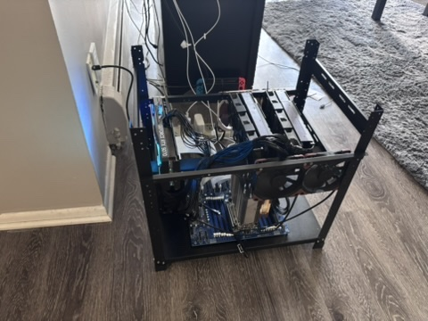

# Unleashing Bare-Metal AI: Building a Local Research Server

The landscape of artificial intelligence is increasingly dominated by massive, closed-source models hidden behind APIs. While these cloud-based models are powerful, I don't completely trust the privacy promises made by their vendors. The technology feels abstracted from the consumer, painting a bleak picture for data privacy and preventing users from fully utilizing the power of open-source LLMs.

Imagine having a powerful model hooked up to your local network. The possibilities are truly endless: you can build an isolated smart-home system, configure a private coding assistant to run and host applications, and deploy a private, ChatGPT-like server using open models that won't build an advertising profile based on your queries.

Driven by these reasons and a desire to understand what it takes to deploy AI models from bare metal to the application layer, I built my own homelab this year boasting 60GB of total VRAM. Best of all, I exclusively used open-source software and models to integrate it into my network. It is easier than you think!

## The Hardware: Building the Compute Cluster

To support the VRAM-heavy demands of local LLM inference, I sourced components that prioritize enterprise-grade compute stability and high memory bandwidth. Here is the exact hardware bill of materials powering the server:

### Core Compute & System Memory
* **CPU:** AMD EPYC Rome 32-Core 7532 (3.35GHz) – Essential for providing the massive PCIe lane availability required for unbottlenecked multi-GPU passthrough.
* **Motherboard:** Gigabyte MZ01-CE1 SP3 DDR4 Server Motherboard
* **RAM:** Crucial by Micron 64GB

### Graphics Processing
* **Primary Accelerators:** 2x Zotac NVIDIA RTX 3090 24GB Passive Server GPUs and 1x NVIDIA RTX 5070 GPU
* **Risers:** GLOTRENDS 200mm PCIe 4.0 X16 Riser Cables (to accommodate the custom multi-GPU spacing).

### Chassis, Power, & Thermal Management
* **Frame:** The Sluice V.2 12 GPU Mining Rig Frame – An open-air chassis that allows for flexible PCIe riser placement and unconstrained thermal dissipation.
* **Power Supply:** CORSAIR HX1500i (2025) Fully Modular Ultra-Low Noise ATX (1500W) – Critical for absorbing the intense transient power spikes of multi-GPU inference.
* **CPU Cooling:** Noctua NH-U14S TR4-SP3 Premium-Grade CPU Cooler
* **System Airflow:** 5x Noctua NF-F12 iPPC 3000 PWM Heavy Duty Cooling Fans (120mm, Black) – Industrial-grade 3000 RPM fans necessary to force high-static pressure air through the passive GPU heatsinks.

While this list does not include absolutely everything, it is quite exhaustive. The total build cost came out to approximately $5,000 USD (unfortunately driven up by the rising cost of RAM).
